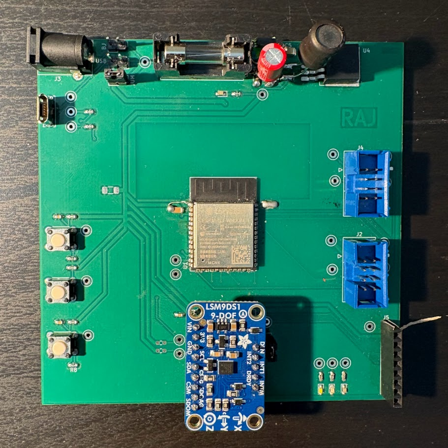
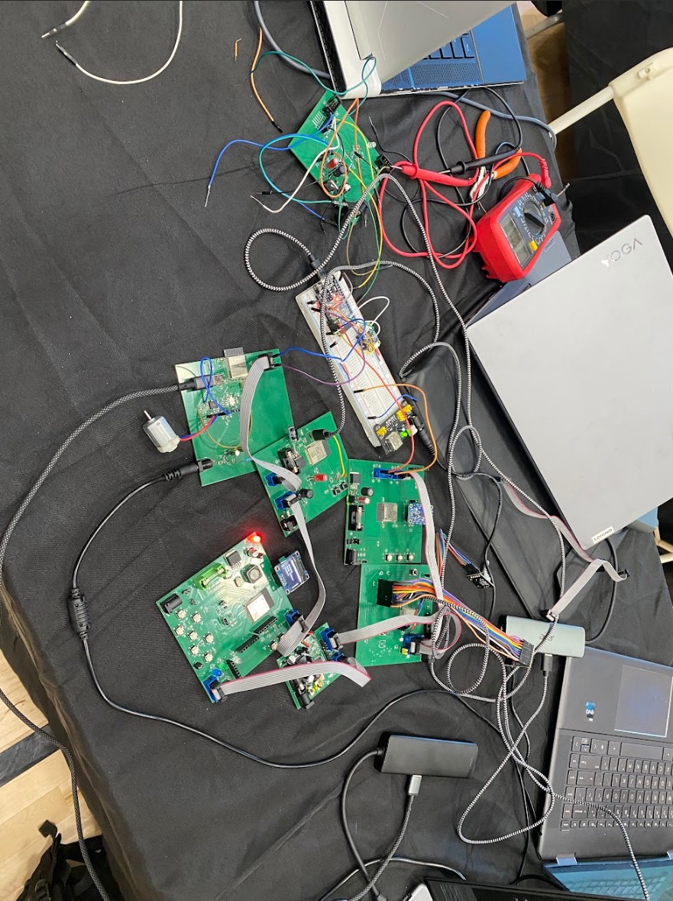

  <button type="button" aria-label="Previous" onclick="var c=this.parentNode;var s=c.querySelectorAll('.mars-imu-slide');var i=(parseInt(c.getAttribute('data-carousel-index'),10)-1+3)%3;c.setAttribute('data-carousel-index',i);s.forEach(function(el,j){el.style.display=j===i?'block':'none';});" style="flex-shrink: 0; width: 36px; height: 36px; border-radius: 50%; border: 1px solid rgba(255,255,255,0.4); background: rgba(255,255,255,0.1); color: #fff; font-size: 1.25rem; cursor: pointer; display: flex; align-items: center; justify-content: center;">‹</button>
  

    

    

    
<iframe src="https://www.youtube.com/embed/OUy0Lak9kGo" title="Mars Scout Rover IMU Navigation Subsystem - Demo Video" style="width:100%;height:100%;border:none;" allowfullscreen></iframe>

  

  <button type="button" aria-label="Next" onclick="var c=this.parentNode;var s=c.querySelectorAll('.mars-imu-slide');var i=(parseInt(c.getAttribute('data-carousel-index'),10)+1)%3;c.setAttribute('data-carousel-index',i);s.forEach(function(el,j){el.style.display=j===i?'block':'none';});" style="flex-shrink: 0; width: 36px; height: 36px; border-radius: 50%; border: 1px solid rgba(255,255,255,0.4); background: rgba(255,255,255,0.1); color: #fff; font-size: 1.25rem; cursor: pointer; display: flex; align-items: center; justify-content: center;">›</button>

_EGR 314 | Arizona State University | Spring 2026 | Team 305 | Professor : [Kevin Nichols](https://www.linkedin.com/in/kevin-nichols-45180b73/)_

## Tech Stack / Platform

KiCad · PCB Design · ESP32-S3 · Embedded C · I2C · UART · LSM9DS1 (9-DOF IMU) · Buck Regulator · Power Budgeting · SMD Soldering · Systems Integration · Embedded Firmware

## Abstract

For EGR 314, our team built a remotely operated Mars Scout Rover for a planetary exploration-style demo. We split the rover into seven slices of responsibility: each person owned a custom board for things like driving, sensing the environment, spotting obstacles, navigation, cameras, radio, and the operator display.

Those boards all talked to each other on one shared serial bus we defined as a class, so telemetry (and video) could flow back to a laptop ground station.

I owned **navigation**: a small board whose job is to tell the rover **how it’s oriented** (tilt, motion, and heading), so higher-level decisions aren’t flying blind.

---

## Content

### My Subsystem Build

#### Hardware

- Drew the full circuit and a two-layer PCB in KiCad, then sent it out for fabrication, the same flow you’d use on a real prototype, not just a breadboard sketch.
- Ran the board on an **ESP32-S3** so I had a modern, capable microcontroller with room to grow.
- Added a **9-axis IMU** so the rover can sense rotation, linear motion, and magnetic heading in one place.
- Stepped **12 V** from a barrel jack down to a clean **3.3 V** rail for the sensitive parts, with a fuse and the usual “make it debuggable” touches (pull-ups, LEDs, a USB debug connector).
- Built the physical board myself (**hand-soldered SMD**) and brought it up until the sensors and comms were behaving.

#### Firmware & getting the team bus working

The rover only works if every board speaks the same language on the shared serial line. I wrote the ESP32-side software that **joins that conversation cleanly**: listening for framed messages, unpacking them reliably, handing off what isn’t mine, and replying when the operator display asks for fresh motion data. Along the way I stress-tested against teammates’ boards (some on ESP32, some on MicroPython) until we were satisfied it wasn’t “my node works alone,” but **the chain works together**.

#### Power Design

- Sized the 3.3 V rail with a straightforward power budget (what happens under stress, what happens when things are quiet) and checked that the regulator was realistically loaded across the components I cared about.

### Highlights

> Seven teammates, seven custom boards, one shared bus tying the rover together.
> I carried this subsystem from schematic and layout through fab, soldering, bring-up, and firmware, not just a CAD exercise.
> A single IMU package gives gyro, accel, and magnetometer so orientation isn’t stitched together from three mismatched breakout boards.
> The “hard part” of integration wasn’t soldering; it was behaving predictably alongside everyone else’s code and hardware at full system test.

---

## Resources

- [Individual Report Website](https://rrangasa.github.io/EGR314raj.github.io/)
- [Team Report Website](https://egr314-s-2026-30.github.io/EGR314-S-2026-305.github.io/)
- [GitHub Repository](https://github.com/rgragulraj/EGR314_Final-raj)
