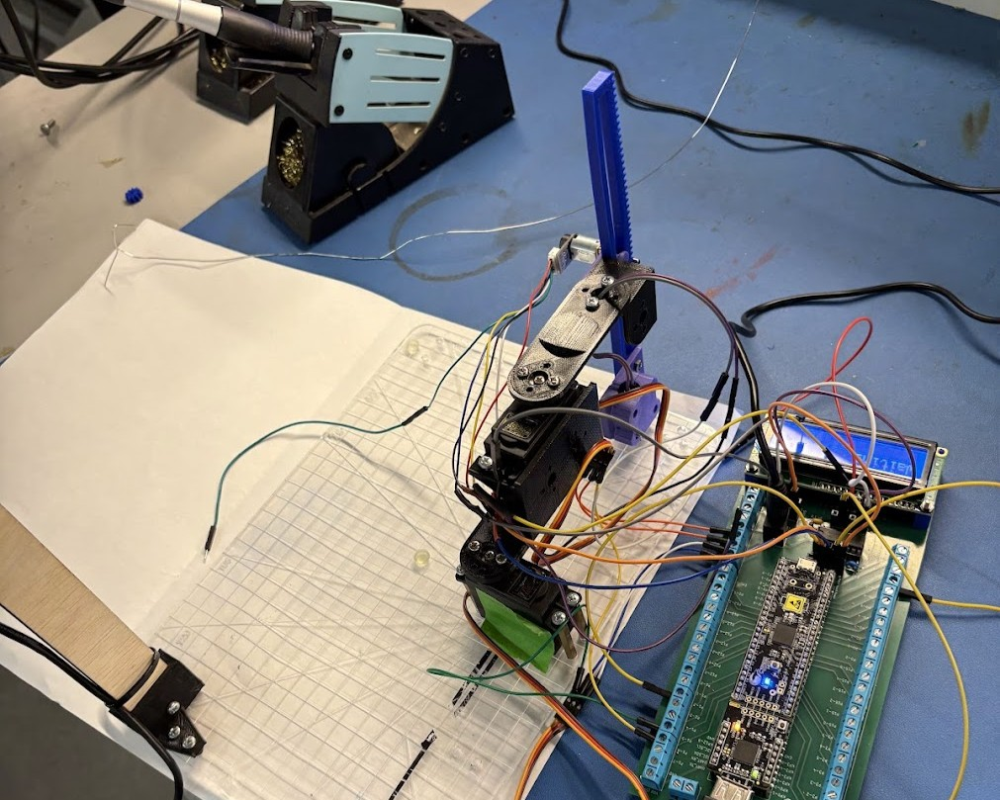

## Tech Stack / Platform

Python · OpenCV · Cypress PSoC 5LP (CY8CKIT-059) · UART · PWM Servo Control · Electromagnet End-Effector

## Abstract

For the final challenge in EGR 455 – Robotic Systems I (taught by [Dr. Kevin Nichols](https://www.linkedin.com/in/kevin-nichols-45180b73/)), I designed and built a fully autonomous 3-DOF pick-and-place manipulator integrating inverse kinematics, camera-based localization, and embedded control.

Python handled vision and kinematic computation. A Cypress PSoC 5LP handled real-time actuation and magnet control via UART communication. The system completed a full pick-and-place cycle autonomously with minimal user input.

This project forced theory—kinematics, coordinate transforms, control—into a working robotic system.

---

## Content

### Architecture

End-to-end pipeline:

Camera → Pixel coordinates → Homogeneous transformation → Workspace coordinates → Inverse kinematics → UART transmission → PWM servo control → Electromagnet actuation → Repeat.

Python managed perception and math. PSoC handled deterministic joint control and hardware timing.

The manipulator completed autonomous cycles and returned to a defined home position before triggering the next detection.

### Manipulator Design

2-revolute-joint configuration with rack-and-pinion vertical motion and an electromagnet end-effector.

Servos were driven via PWM from the PSoC. Joint angles computed in Python were converted into compare values and executed on PSOC.

This was my first full implementation of translating linkage geometry into a physically constrained manipulator with a defined workspace and drop zone.

### Inverse Kinematics

I derived and implemented the inverse kinematics in Python to convert (X, Y, Z) workspace coordinates into joint angles within servo limits.

This reinforced: workspace constraints, singularities, practical reachability limits, and the difference between mathematical solutions and physically valid ones.

### Vision & Frame Transformation

Object detection was implemented in OpenCV using color and background subtraction.

I manually: measured calibration points, computed pixel-to-physical scaling, and constructed a homogeneous transformation matrix to convert camera-frame coordinates into base-frame coordinates.

Small calibration errors directly impacted end-effector accuracy—this made coordinate consistency tangible.

### Embedded Control & UART

Python transmitted 8-bit joint variables over UART to the PSoC.

On the microcontroller side: blocking receive loops ensured synchronization, angles were converted to PWM signals, and a handshake protocol triggered the next cycle.

This was my first experience coordinating high-level planning with embedded execution.

### Electromagnet Control

The end-effector used an inductor-based electromagnet controlled by the PSoC.

Activation timing was tightly managed to: prevent overheating, ensure clean pickup and release, and maintain repeatable cycles.

### Challenges & Solutions

| Challenge | Solution |
| --- | --- |
| Camera-to-base frame mismatch | Manual calibration + homogeneous transform |
| UART synchronization issues | Blocking receive logic + structured transmission |
| Angle-to-PWM inconsistencies | Explicit conversion and tuning |
| Workspace reach violations | Constrained IK within physical limits |

---

## Insights

Robotics I (EGR 455) taught me how to think in complete robotic systems—not isolated components.

I learned how kinematics, sensing, coordinate transformations, and embedded control must align for autonomy to work. Small errors in calibration, timing, or logic propagate through the entire pipeline.

This project was my first fully integrated robotic system running end-to-end—from perception to actuation—without manual intervention.

It turned robotics from equations into engineering.

## Resources

- [OpenCV](https://opencv.org/)
- [Cypress PSoC 5LP (CY8CKIT-059)](https://www.infineon.com/cms/en/product/evaluation-boards/cy8ckit-059/)
