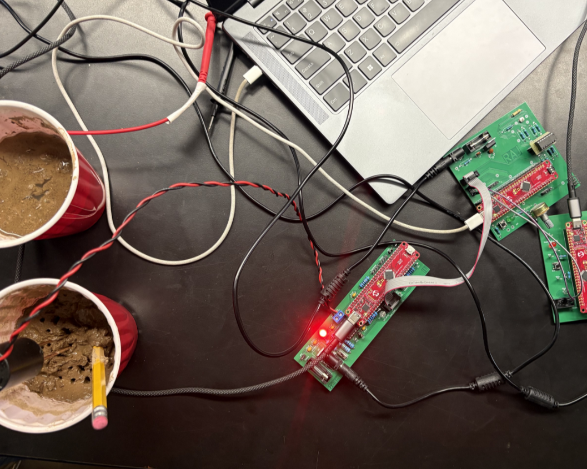

## Tech Stack / Platform

PIC18 Microcontrollers · MPLAB X · KiCAD · Embedded C · Custom PCB Design · Capacitive Soil Moisture Sensor · Light Sensor · Multi-Board Communication

## Abstract

As part of EGR 304 – Microprocessor Systems (taught by [Dr. Dan Aukes](https://www.linkedin.com/in/dan-aukes-502995212/)), our team designed and built a fully autonomous irrigation system using the Microchip PIC microcontroller family. The system made watering decisions based solely on real-time soil moisture and sunlight measurements.

Each subsystem ran on its own PIC board, and we designed custom PCBs in KiCAD to integrate sensing, control, and power distribution.

The objective was to develop low-level embedded systems fluency through full-stack hardware–firmware integration. Just as importantly, this course walked us through the professional process of turning an initial idea into a working product, and it ended up being one of the classes where I learned the most.

Check out the [team website](https://egr304-2025-f-101.github.io/team101.github.io/) and [individual subsystem documentation](https://rrangasa.github.io/EGR304raj.github.io/) for more details.

---

## Content

### System Overview

Four PIC-based subsystems handled sensing, decision logic, and actuation.

**Pipeline:**

Soil Moisture + Sunlight → Embedded Decision Logic → Watering Command → Valve Control

No timers were used—the system operated entirely on environmental inputs and user-defined moisture thresholds.

### My Contribution

I owned the core decision-making subsystem.

I:

- Retrieved raw data from the capacitive soil moisture subsystem
- Processed light sensor input
- Compared readings against user-defined moisture levels
- Issued watering commands to the actuation subsystem

This required cross-board communication, ADC configuration, and reliable embedded control logic.

### Key Takeaways

- Multi-microcontroller system architecture
- Custom PCB design with KiCAD and hardware integration
- Analog sensor acquisition and calibration
- Embedded C firmware development in the PIC ecosystem

**More than anything, this class taught me the professional process of taking an idea all the way to a working product—and it was easily one of the courses where I learned the most.**

This project strengthened my ability to design embedded systems from schematic to firmware to integrated operation.

---

## Gallery

## Resources

- [Team Site](https://egr304-2025-f-101.github.io/team101.github.io/) · [Individual Datasheet](https://rrangasa.github.io/EGR304raj.github.io/)
