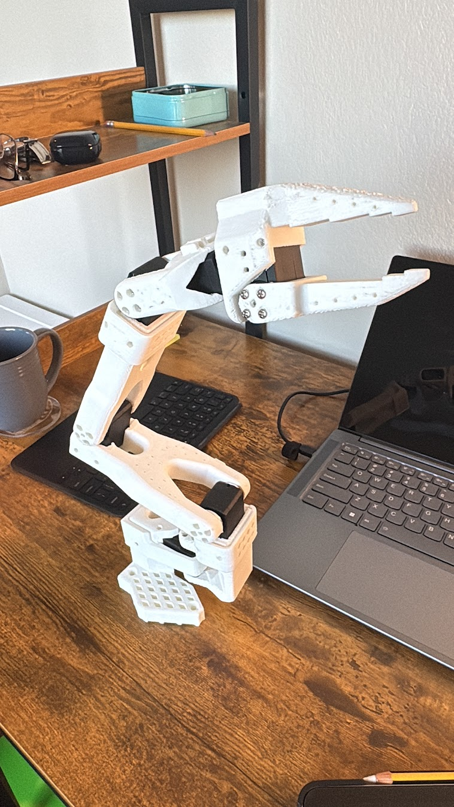

## Abstract

I'm running experiments on imitation learning for a robot arm using [LeRobot](https://github.com/huggingface/lerobot). I built a 6-DOF SO-101 arm and hooked it up to LeRobot. I use an Xbox controller to drive the arm and my phone as the camera. Everything runs on Ubuntu. This doc covers my setup, how I collect data, and how I train the arm.

## 1. Introduction

LeRobot is an open-source Python library from Hugging Face. It has models, datasets, and tools for robotics. I wanted to try it on cheap hardware: a SO-101 arm I built, an Xbox controller, and my phone camera.

## 2. Materials and Methods

### 2.1 Hardware

- **Arm:** SO-101 6-DOF (I built it from an open-source design)
- **Control:** Xbox controller
- **Camera:** Smartphone
- **Computer:** Ubuntu Linux

### 2.2 Software

- **Framework:** [LeRobot](https://github.com/huggingface/lerobot)
- **OS:** Ubuntu Linux

LeRobot has a Robot interface that works with different hardware. It supports SO100-style arms. Data is stored in LeRobotDataset format (Parquet plus video or images).

### 2.3 Data Collection

I drive the arm with the Xbox controller and record what the phone camera sees. The data goes into LeRobotDataset format for training.

### 2.4 Training

I train policies with LeRobot's imitation learning tools (ACT, Diffusion, VQ-BeT). I use the `lerobot-train` script with my dataset and policy settings.

## 3. Experiments

I'm working on:

1. **Teleoperation:** Mapping Xbox inputs to arm commands
2. **Data collection:** Recording vision and actions together
3. **Policy training:** Training on my demos
4. **Deployment:** Running the trained policy on the real arm for tasks like pushing objects

## 4. Results and Discussion

*Ongoing.* I'll add results as I go. Right now I'm focused on getting stable data collection and policies that converge before trying real-world runs.

## 5. Conclusion

LeRobot works with low-cost hardware. My setup (SO-101 arm, Xbox controller, phone camera) is cheap and lets me learn manipulation policies. I'll add numbers on success rates when I have them.

## References

- [LeRobot on GitHub](https://github.com/huggingface/lerobot)
- [LeRobot Documentation](https://huggingface.co/docs/lerobot)
