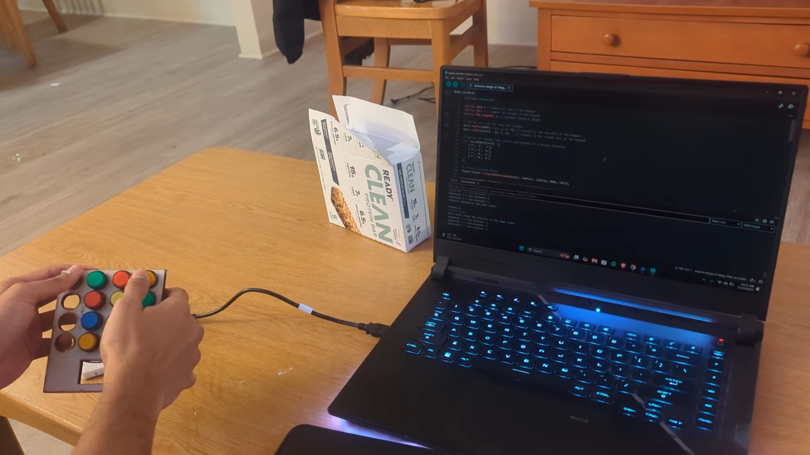
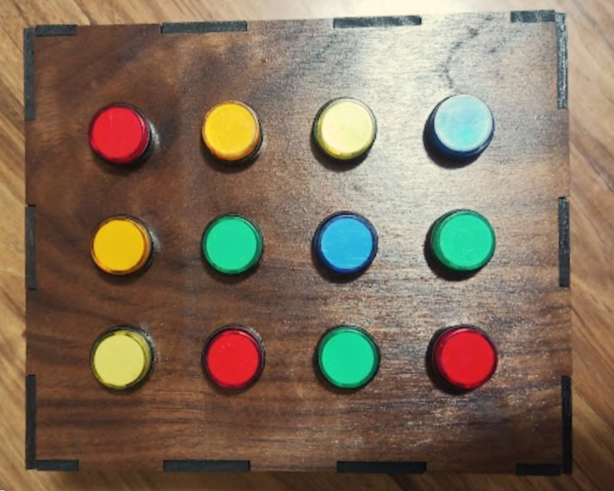
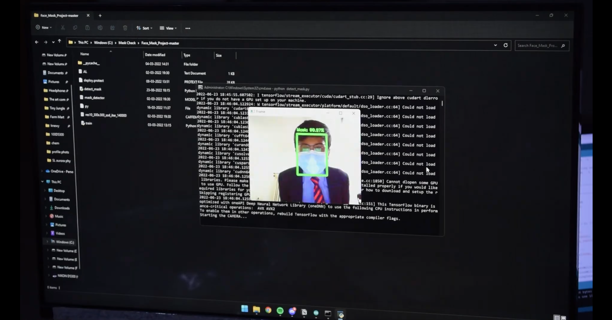
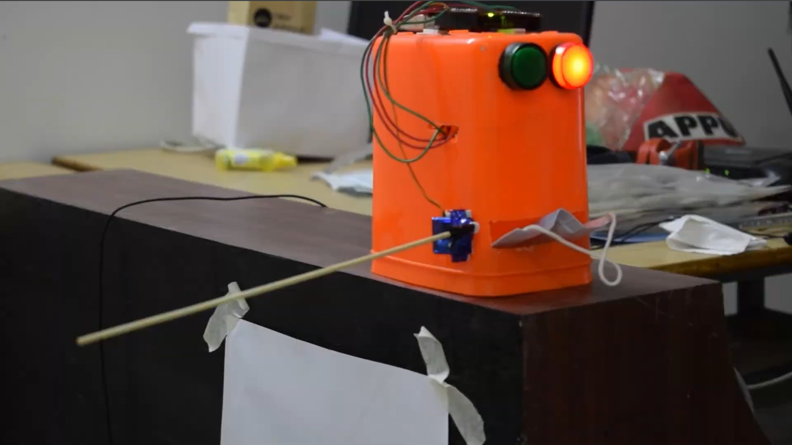
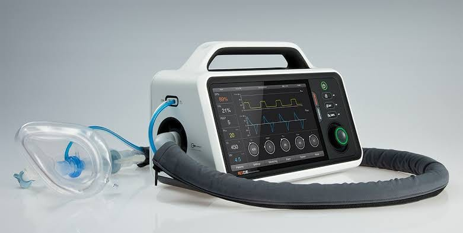
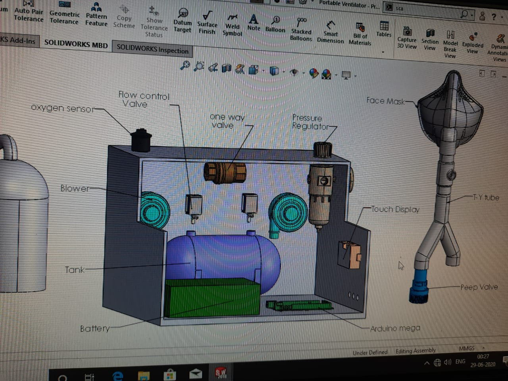
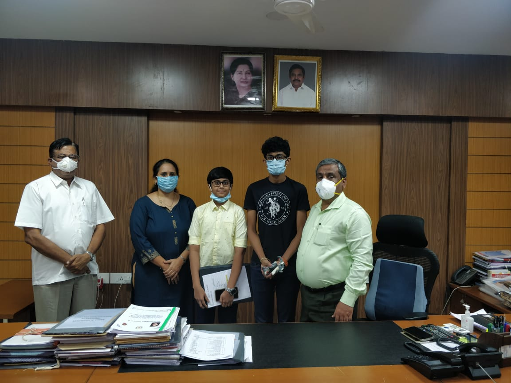
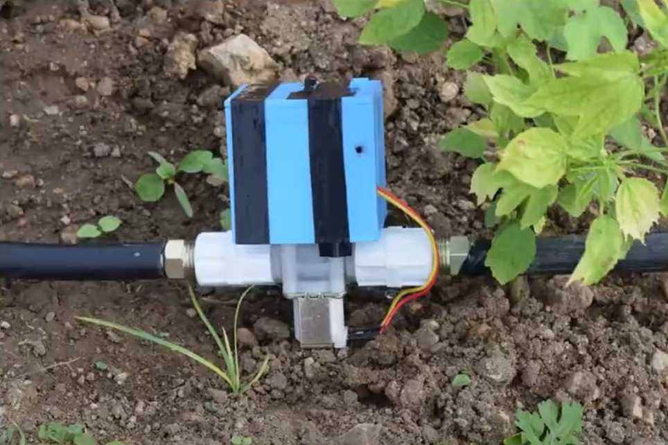

## Overview

Before my formal robotics coursework, I built a series of hardware and embedded systems projects that shaped my interest in robotics and intelligent systems. These ranged from competition prototypes to socially motivated designs.

---

## Memory-Based STEM Game (EGR 201 – Team Project)

_2024_

Developed an interactive memory game for elementary students.

  <button type="button" aria-label="Previous" onclick="var c=this.parentNode;var s=c.querySelectorAll('.carousel-slide');var i=(parseInt(c.getAttribute('data-carousel-index'),10)-1+2)%2;c.setAttribute('data-carousel-index',i);s.forEach(function(el,j){el.style.display=j===i?'block':'none';});" style="flex-shrink: 0; width: 36px; height: 36px; border-radius: 50%; border: 1px solid rgba(255,255,255,0.4); background: rgba(255,255,255,0.1); color: #fff; font-size: 1.25rem; cursor: pointer; display: flex; align-items: center; justify-content: center;">‹</button>
  

    

    

  

  <button type="button" aria-label="Next" onclick="var c=this.parentNode;var s=c.querySelectorAll('.carousel-slide');var i=(parseInt(c.getAttribute('data-carousel-index'),10)+1)%2;c.setAttribute('data-carousel-index',i);s.forEach(function(el,j){el.style.display=j===i?'block':'none';});" style="flex-shrink: 0; width: 36px; height: 36px; border-radius: 50%; border: 1px solid rgba(255,255,255,0.4); background: rgba(255,255,255,0.1); color: #fff; font-size: 1.25rem; cursor: pointer; display: flex; align-items: center; justify-content: center;">›</button>

- **What it did**:
  - Custom game logic with multiple modes (memory + soundboard)
  - Designed to encourage cognitive engagement indoors
  - Focused on accessible, student-friendly hardware interaction

---

## Smart Mask Detection Gate (Competition Project)

_2023_

My first hardware–software integration project.

  <button type="button" aria-label="Previous" onclick="var c=this.parentNode;var s=c.querySelectorAll('.mask-slide');var i=(parseInt(c.getAttribute('data-carousel-index'),10)-1+2)%2;c.setAttribute('data-carousel-index',i);s.forEach(function(el,j){el.style.display=j===i?'block':'none';});" style="flex-shrink: 0; width: 36px; height: 36px; border-radius: 50%; border: 1px solid rgba(255,255,255,0.4); background: rgba(255,255,255,0.1); color: #fff; font-size: 1.25rem; cursor: pointer; display: flex; align-items: center; justify-content: center;">‹</button>
  

    

    

  

  <button type="button" aria-label="Next" onclick="var c=this.parentNode;var s=c.querySelectorAll('.mask-slide');var i=(parseInt(c.getAttribute('data-carousel-index'),10)+1)%2;c.setAttribute('data-carousel-index',i);s.forEach(function(el,j){el.style.display=j===i?'block':'none';});" style="flex-shrink: 0; width: 36px; height: 36px; border-radius: 50%; border: 1px solid rgba(255,255,255,0.4); background: rgba(255,255,255,0.1); color: #fff; font-size: 1.25rem; cursor: pointer; display: flex; align-items: center; justify-content: center;">›</button>

- **What it did**:
  - Implemented real-time face mask detection using OpenCV (Python)
  - Integrated with an Arduino-controlled gate prototype
  - Designed as part of a school robotics and computer science competition
- **What I learned**: This was my first experience connecting computer vision to physical actuation.

---

## Low-Cost Emergency Ventilator (COVID Response)

_2021_

  <button type="button" aria-label="Previous" onclick="var c=this.parentNode;var s=c.querySelectorAll('.ventilator-slide');var i=(parseInt(c.getAttribute('data-carousel-index'),10)-1+3)%3;c.setAttribute('data-carousel-index',i);s.forEach(function(el,j){el.style.display=j===i?'block':'none';});" style="flex-shrink: 0; width: 36px; height: 36px; border-radius: 50%; border: 1px solid rgba(255,255,255,0.4); background: rgba(255,255,255,0.1); color: #fff; font-size: 1.25rem; cursor: pointer; display: flex; align-items: center; justify-content: center;">‹</button>
  

    

    

    

  

  <button type="button" aria-label="Next" onclick="var c=this.parentNode;var s=c.querySelectorAll('.ventilator-slide');var i=(parseInt(c.getAttribute('data-carousel-index'),10)+1)%3;c.setAttribute('data-carousel-index',i);s.forEach(function(el,j){el.style.display=j===i?'block':'none';});" style="flex-shrink: 0; width: 36px; height: 36px; border-radius: 50%; border: 1px solid rgba(255,255,255,0.4); background: rgba(255,255,255,0.1); color: #fff; font-size: 1.25rem; cursor: pointer; display: flex; align-items: center; justify-content: center;">›</button>

Designed alongside an international championship team during COVID shortages.

- **What it did**:
  - Focused on low-cost, easily sourced components
  - Intended as a temporary emergency solution during ventilator shortages (Covid-19)
  - Recognized by the Dean of Government Medical College, Coimbatore and the Collectorate of Coimbatore
- **What I learned**: This project gave me hands-on experience in constraint-driven design and building technology with real social impact.

---

## Basic Garden Automation System

_2019_

  <button type="button" aria-label="Previous" onclick="var c=this.parentNode;var s=c.querySelectorAll('.garden-slide');var i=(parseInt(c.getAttribute('data-carousel-index'),10)-1+2)%2;c.setAttribute('data-carousel-index',i);s.forEach(function(el,j){el.style.display=j===i?'block':'none';});" style="flex-shrink: 0; width: 36px; height: 36px; border-radius: 50%; border: 1px solid rgba(255,255,255,0.4); background: rgba(255,255,255,0.1); color: #fff; font-size: 1.25rem; cursor: pointer; display: flex; align-items: center; justify-content: center;">‹</button>
  

    

    
<iframe src="https://www.youtube.com/embed/pPG_WdgbR78" title="Basic Garden Automation System – Video" style="width:100%;height:100%;border-radius:6px;border:none;" allowfullscreen></iframe>

  

  <button type="button" aria-label="Next" onclick="var c=this.parentNode;var s=c.querySelectorAll('.garden-slide');var i=(parseInt(c.getAttribute('data-carousel-index'),10)+1)%2;c.setAttribute('data-carousel-index',i);s.forEach(function(el,j){el.style.display=j===i?'block':'none';});" style="flex-shrink: 0; width: 36px; height: 36px; border-radius: 50%; border: 1px solid rgba(255,255,255,0.4); background: rgba(255,255,255,0.1); color: #fff; font-size: 1.25rem; cursor: pointer; display: flex; align-items: center; justify-content: center;">›</button>

Early summer project implementing:

- **What it did**:
  - Capacitive soil moisture sensing
  - Arduino-based solenoid valve control
  - Simple threshold-based watering logic
- **What I learned**: This project was an early precursor to my later embedded irrigation work.

---

## Cardiac Alert Watch (Google Science Fair Entry)

_2018_

Arduino-based wearable prototype with:

  <button type="button" aria-label="Previous" onclick="var c=this.parentNode;var s=c.querySelectorAll('.cardiac-slide');var i=(parseInt(c.getAttribute('data-carousel-index'),10)-1+2)%2;c.setAttribute('data-carousel-index',i);s.forEach(function(el,j){el.style.display=j===i?'block':'none';});" style="flex-shrink: 0; width: 36px; height: 36px; border-radius: 50%; border: 1px solid rgba(255,255,255,0.4); background: rgba(255,255,255,0.1); color: #fff; font-size: 1.25rem; cursor: pointer; display: flex; align-items: center; justify-content: center;">‹</button>
  

    

    
<iframe src="https://www.youtube.com/embed/hlLlohm7iBA" title="Cardiac Alert Watch – Video" style="width:100%;height:100%;border-radius:6px;border:none;" allowfullscreen></iframe>

  

  <button type="button" aria-label="Next" onclick="var c=this.parentNode;var s=c.querySelectorAll('.cardiac-slide');var i=(parseInt(c.getAttribute('data-carousel-index'),10)+1)%2;c.setAttribute('data-carousel-index',i);s.forEach(function(el,j){el.style.display=j===i?'block':'none';});" style="flex-shrink: 0; width: 36px; height: 36px; border-radius: 50%; border: 1px solid rgba(255,255,255,0.4); background: rgba(255,255,255,0.1); color: #fff; font-size: 1.25rem; cursor: pointer; display: flex; align-items: center; justify-content: center;">›</button>

- **What it did**:
  - Heart rate sensor integration
  - GSM module for emergency alerts
  - Automatic SMS/call trigger on irregular readings
- **What I learned**: The prototype was early-stage and imperfect, but it marked my first attempt at real-time physiological monitoring and embedded communication.

---
